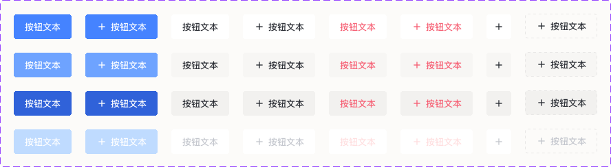
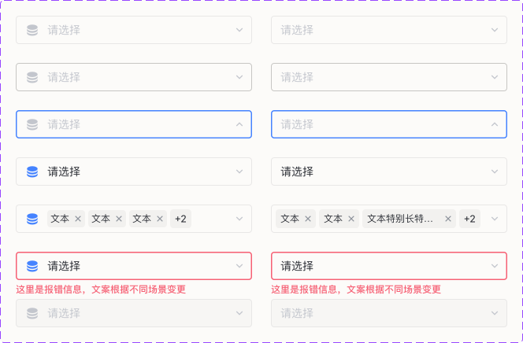
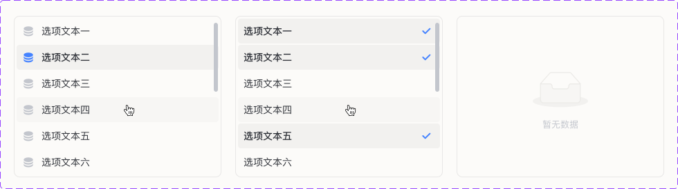
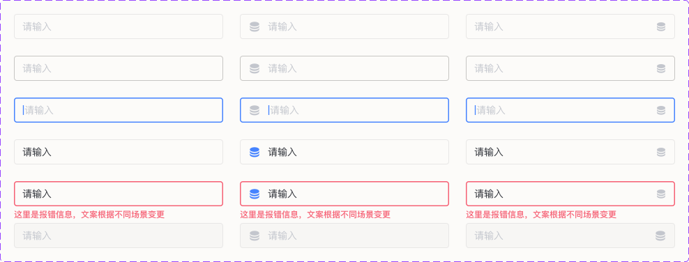

# 前端 UI 设计规范

## 目的

本文档旨在为前端团队提供一致性和规范性的UI设计指导，以确保项目中的界面设计风格、布局和交互的一致性，并提高用户体验和开发效率。

## 设计原则

- 一致性: 确保界面元素、布局和交互在整个应用程序中保持一致。

- 可用性: 注重用户操作的便利性和直观性。用户应该能够轻松地与界面进行交互，并顺利完成任务，而不需要额外的努力或疑惑。

- 简洁明了: 保持界面的简洁性和明了性，避免过多的复杂元素、视觉杂乱和冗余信息。

- 响应式: 项目目前设置了最小宽度，需保证在最小宽度范围内样式不会出现崩坏。

## 颜色规范

### 主色调以及字体规范

[Figma](https://www.figma.com/file/l7eIXVVjdlaPwMMXEkG1f5/%E7%88%B1%E5%8F%AF%E7%94%9FSQLE%E5%90%8E%E5%8F%B0?node-id=1084%3A11623&mode=dev)

## 图标规范

1. 图标格式：项目中默认采用SVG格式的图标。SVG格式的图标具有矢量特性，可以无损缩放而不失真，适应不同尺寸的展示。
2. 图标存放位置：项目中的公共图标统一存放在`shared/lib/Icon`目录下，特殊的图标存放在各个项目的`src/icon`目录下。后续计划将图标进行统一抽离，形成一个类似于`@ant-design/icons`的公共包，并提供预览和搜索功能。
3. 图标命名和定义规范：后续改造后的公共图标包将遵循一套统一的图标命名规范和定义规范。这些规范将有助于更好地管理和使用图标。
4. 图标颜色：改造后图标的颜色将与父元素的颜色保持一致，采用 currentColor 表示。在使用 currentColor 时，需要确保图标颜色与设计图上保持一致。
5. 图标与文字间隔：图标与文字之间应有一定的间隔，并且不同位置的间隔大小可能不相同。例如，标题处的图标与文字的间隔可能与表格中图标与文字的间隔不同，需要根据具体情况进行调整。
6. [如何添加一个自定义图标?] todo..

## 布局规范

项目采用了左右布局的风格，具体细节如下：

1.左侧菜单栏具有固定宽度为220像素（px）。这意味着菜单栏的宽度将保持不变，无论其内容的多少。
2.右侧内容区域采用自适应宽度，并且最小宽度为1060像素（px）。这表示右侧内容区域的宽度会根据浏览器窗口的大小自动调整，但不会小于1060像素，以确保内容在较小的屏幕上也能够正常显示。
  
### 左侧菜单栏

左侧菜单栏具有以下特点：

1. 使用position: sticky; top: 0;属性来实现固定在顶部，不随着右侧页面的滚动条滚动而滚动。你可以在[这里]((https://developer.mozilla.org/zh-CN/docs/Web/CSS/position#sticky))了解更多关于sticky属性的信息。
2. 左侧菜单栏拥有自己的滚动条。在菜单数量较多的情况下，菜单栏会出现滚动条，使用户可以独立滚动菜单内容，而不影响右侧页面的滚动。
3. 左侧菜单栏具有左右两侧各为16像素的内边距。

### 右侧主体页面

右侧主体页面通常采用上下结构，并由以下两种常见的组合方式构成：

1. Header + Content：这种结构适用于需要在页面中展示一块较大内容的情况。Header通常包含页面的标题、导航以及其他相关操作，而Content则是主要的页面内容区域。
2.
3. Header + TableToolbar + Table：这种结构适用于需要展示表格数据的情况。除了Header和Content外，还包含TableToolbar作为表格的操作栏，可以包括搜索框、筛选条件、新增按钮等功能，而Table则是实际的表格展示区域。

## 组件规范

<h3 id="LeftMenu">左侧菜单</h3>

1. Title

   - 需要注意字体粗细以及字体大小样式。
   - 默认标题以及自定义标题两种情况下的字体颜色。
  
2. 项目选择器

   在 [下拉选择器](#BasicSelect) 的基础上做以下调整
   - 添加 prefix icon，需要注意 icon 颜色和尺寸。
   - 背景颜色调整为: `var(--color-fill-tertiary，#F7F6F4);`
   - 边框颜色固定为: `var(--color-border-secondary，#E8E7E6);`
   - 下拉菜单出现位置调整至右侧，同时改变尾部 Icon. 由向下的方向调整为向右。
   - 下拉菜单内容调整为自定义菜单，拥有搜索框、MenuItems以及按钮，需要注意该部分的样式细节。

3. 菜单选项

   基于 antd 的 [Menu](https://ant-design.antgroup.com/components/menu-cn) 做了一些样式上的细节调整.

   注意事项:
   - 通过调整菜单项的 padding 和图标与文字之间的 margin 实现内部边距和间隔的调整。
   - 菜单项 Hover 状态、选中状态和常态之间的区别。例如背景颜色、前缀 Icon 和尾部 Icon 的变化。
   - 下拉菜单与常规菜单项之间的区别。
   - 菜单组与常规菜单之间的区别。
   - 菜单项里的文本字体样式。

4. 底部用户个人中心和全局配置

   - 在底部用户个人中心和全局配置中使用公共的[用户头像组件](#AvatarCom) ，确保头像的一致性和可复用性。
   - 对于用户菜单中的用户名文本，请使用与设计一致的字体样式，如字体大小、颜色和字体样式，以确保整体视觉一致性和可读性。
   - 针对全局设置中的标题部分和尾部文本，请使用与设计一致的字体样式，包括字体大小、颜色和字体样式，以确保信息的可读性和视觉一致性。
   - 菜单项的样式细节，例如 hover 效果以及内间距以及 Icon 与文本之间的间隔。
   - 主题切换器的样式细节，例如边框颜色以及背景颜色。
   - 在全局设置菜单中，对于激活状态和常态下的菜单项图标，请设置适当的颜色变换，以突出激活状态，并与整体设计风格一致。

<h3 id="BasicButton">按钮</h3>

注意事项:

1. 保证按钮的阴影效果与设计图一致，以确保整体一致性。
2. 按钮处于点击状态时的样式细节与设计图保持一致，以确保整体一致性。
3. 不同尺寸下按钮的内边距以及字体大小与设计图保持一致，以确保整体一致性。
4. 如果按钮包含图标，请确保图标的颜色与整体设计一致，并设置适当的间隔来调整图标与文本之间的间距。确保图标与文本对齐和平衡。
5. 按钮使用的类型与设计图一致。

<h3 id="BasicSelect">下拉选择器</h3>

1. 不同状态下边框的颜色：确保在不同状态下，如正常、激活和错误状态，边框的颜色与设计一致，以提供一致的视觉反馈。

2. placeholder的文本样式：对placeholder文本采用与设计一致的样式，如颜色、字体大小和字体样式，以确保整体一致性。

3. 选中值的文本样式：对于选中的值，请使用与设计一致的字体样式，同时考虑超长内容的情况，确保文本可以适应并正常显示。

4. 多选模式下值的标签样式：对于多选模式下的选中值标签，请使用与设计一致的样式，同时注意处理超长内容，以确保标签可以正确显示。

5. 存在前缀图标的情况：如果下拉选择器具有前缀图标，请确保图标的大小、对齐和颜色与设计一致，以保持统一性。

6. 尾部Arrow Icon的样式以及Clear Icon的样式：对于尾部的展开箭头图标和清除图标，请使用与设计一致的样式，包括颜色、大小和交互效果。

7. 禁用模式下的样式：对于禁用状态的下拉选择器，请使用符合设计规范的样式，如灰色的文本颜色和禁用状态的边框颜色，以明确表达不可编辑的状态。

8. 下拉菜单样式：根据设计规范，确保下拉菜单的样式与其他相关组件一致，包括单选和多选情况。同时，需要注意下拉菜单的宽度，以适应选项内容的长度。

9. 下拉菜单暂无数据以及正在加载数据的样式：根据设计规范，为下拉菜单的暂无数据和正在加载数据的情况提供合适的样式，以向用户传达相关信息。

10. 错误信息的字体样式：对于错误信息的展示，请使用与设计一致的字体样式，如红色文本颜色和适当的错误提示图标，以提醒用户选择有误。

11. 准确使用组件的尺寸大小：根据设计规范，确保下拉选择器的尺寸与其他相关组件的尺寸一致，如按钮、输入框等，以保持整体视觉平衡和一致性。

12. 在可聚焦状态下需要注意输入的光标样式：对于可聚焦状态下的下拉选择器，请使用与设计一致的样式和颜色，以提供清晰的输入焦点反馈，包括光标样式和颜色。

<h3 id="BasicInput">文本输入框</h3>

1. 不同状态下边框的颜色：确保在不同状态下，如正常、激活和错误状态，边框的颜色与设计一致，以提供一致的视觉反馈。

2. placeholder的文本样式：对placeholder文本采用与设计一致的样式，如颜色、字体大小和字体样式，以确保整体一致性。

3. 拥有前缀Icon和尾部Icon的情况：如果输入框需要显示前缀Icon和尾部Icon，请确保它们的大小、对齐和颜色与设计一致，以保持统一性。

4. 禁用模式下的样式：对于禁用状态的输入框，请使用符合设计规范的样式，如灰色的文本颜色和禁用状态的边框颜色，以明确表达不可编辑的状态。

5. 错误信息的字体样式：对于错误信息的展示，请使用与设计一致的字体样式，如红色文本颜色和适当的错误提示图标，以提醒用户输入有误。

6. 输入值的字体样式：对于输入框中的实际输入值，请使用与设计一致的字体样式，如字体大小、字重和颜色，以确保整体的一致性和可读性。

7. 准确使用组件的尺寸大小：根据设计规范，确保文本输入框的尺寸与其他相关组件的尺寸一致，如按钮、标签等，以保持整体视觉平衡和一致性。

8. 聚焦模式下的输入光标样式：对于输入框在聚焦状态下的光标，请使用与设计一致的样式和颜色，以提供清晰的输入焦点反馈。

<h3 id="AvatarCom">用户头像组件</h3>

由于目前暂不支持用户自定义头像，所以展示无法实现该效果，用户头像组件目前展示用户名的首字母，并用大写形式展示。

当前效果:

<h3 id="PageHeader">页眉</h3>

页眉一般采用左右布局，具体细节如下：

1. 顶部区域的高度固定为60px，具有底部边框，并在左右两侧设置了60px的内边距。

2. 左侧部分一般用于显示页面标题以及可能的刷新数据按钮。请确保页面标题和刷新按钮的样式保持一致。对于表单页面，左侧通常是返回至列表页的按钮，需要特别注意返回按钮的图标。

3. 右侧部分一般包含页面的功能按钮，这些按钮的类型应为主要按钮（primary）。如果右侧没有任何内容，则可以留空。

- 表单
- 二次确认框
- 消息提示
- 弹窗框

## 兼容性

DMS-UI 需要支持的最低 chrome 版本为 80. 需保证使用的 css 属性能够支持在 chrome 80 中有正常的表现.
