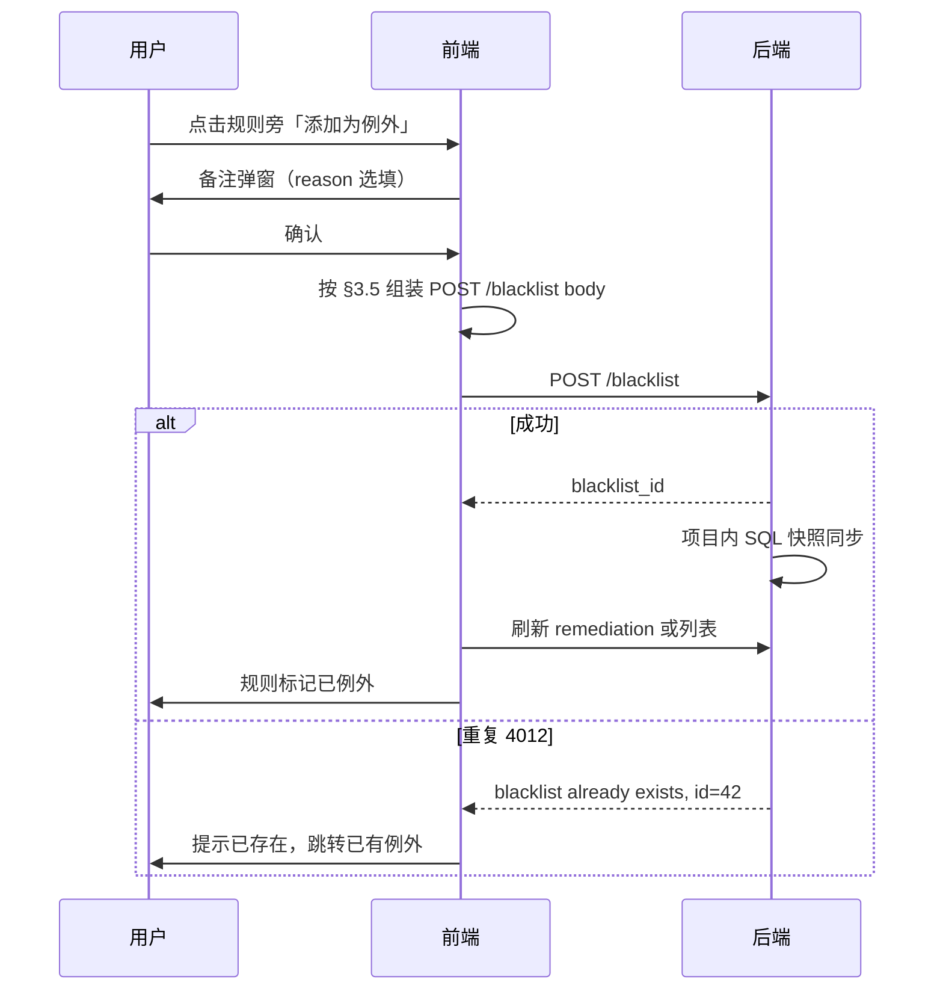

# SQL 管控规则例外 — 前端适配提示词

> 本文档供前端开发直接粘贴给 AI 或作为联调说明。基于 PRD（`prd/sql-manage-rule-exception.md`）与当前 EE 后端实现整理。**联调以 `sqle/docs/swagger.yaml` 与实际响应为准**。

---

## 1. 功能概述

在现有「SQL 管控例外」（后端路由仍称 `blacklist`）基础上，前端需实现两个入口，**写操作均走 blacklist CRUD**，无独立快捷写接口。

### 1.1 例外管理页（入口一）

- **位置**：项目设置 →「SQL 管控例外管理」
- **能力**：
  - 分别配置 **匹配方式**（多维度可组合）与 **生效范围**
  - 各匹配维度可组合；未配置的维度 = 不限
  - 生效范围：不选规则 = 全部规则（老逻辑）；选 1～n 条 = 仅豁免指定规则
  - 列表支持筛选：匹配维度、生效范围模式、添加人、添加时间（筛选区默认折叠，点击「筛选」按钮在搜索框右侧展开；不提供规则名、扫描任务 ID 筛选项）
  - 详情页推荐 `GET /blacklist/{blacklist_id}`

### 1.2 SQL 管控页「添加为例外」（入口二）

- **位置**：SQL 管控列表 / 详情、扫描任务内 SQL 列表 / 详情
- **能力**：
  - 每条**已触发且未例外**的规则旁展示「添加为例外」（icon + 备注弹窗）
  - **前端组装** `POST /blacklist`（见 §2.2、§3.5）
  - 成功后刷新审核数据；已例外规则展示「已例外」标签，点击跳转例外详情（`exception_id`）
  - **取消例外**：`DELETE /blacklist/{exception_id}/`（`exception_id` 来自读接口）

---

## 2. 接口清单

> 响应外壳：`{ "code": 0, "message": "ok", "data": ... }`；失败 `code != 0`。  
> 路径参数 `project_name` 为**项目名称**（非 UID）。

### 2.1 例外 CRUD（blacklist）

| 方法 | 路径 | 说明 |
| --- | --- | --- |
| POST | `/v1/projects/{project_name}/blacklist` | 创建 |
| PATCH | `/v1/projects/{project_name}/blacklist/{blacklist_id}/` | 更新（**带尾斜杠**） |
| GET | `/v1/projects/{project_name}/blacklist` | 列表 |
| GET | `/v1/projects/{project_name}/blacklist/{blacklist_id}` | 详情 |
| DELETE | `/v1/projects/{project_name}/blacklist/{blacklist_id}/` | 删除（**带尾斜杠**） |

#### POST 创建 — Request Body

```json
{
  "type": "fp_sql",
  "content": "select * from orders where id = ?",
  "desc": "慢日志已知误报",
  "match_conditions": [
    { "type": "instance", "content": "123" },
    { "type": "audit_task_type", "content": "mysql_slow_log" },
    { "type": "audit_task_id", "content": "100" },
    { "type": "db_type", "content": "MySQL" }
  ],
  "rule_scope": ["dml_check_where_is_invalid"],
  "reason": "业务主键查询"
}
```

| 字段 | 必填 | 说明 |
| --- | --- | --- |
| type | 是 | 匹配维度类型之一，仅 7 种（§3.2）；API 首条匹配条件 |
| content | 是 | 对应 type 的匹配值 |
| desc | 否 | 描述 |
| match_conditions | 否 | 附加匹配维度（与 type/content **AND**）；每项 `{type, content}` |
| rule_scope | 否 | 省略/`"ALL"`/`[]` → 全部规则；`["rule_name"]` → 指定规则 |
| reason | 否 | 添加备注 |

> **UI 与 API 分离**：后端仍分 `type`+`content` 与 `match_conditions` 存储；**页面勿展示「基础匹配 / 扩展匹配」两列或两块**，统一称 **「匹配方式」**（见 §3.6、§4.1）。

**Response 200**：`{ "data": { "blacklist_id": 42 } }`

**重复**：`code: 4012`，`message`: `blacklist already exists, id=42`

创建/更新/删除成功后，后端会对项目内存量管控 SQL **重算例外快照**（页面即时反映，无需等下一轮审核）。

#### GET 列表 — Query

| 参数 | 说明 |
| --- | --- |
| filter_type | 按匹配维度 type 筛选（API 字段名不变） |
| fuzzy_search_content | 模糊匹配 content |
| filter_rule_scope_mode | `all` \| `specific` |
| filter_rule_name | 生效范围含该规则名（**列表页前端不提供此筛选项**；API 仍支持） |
| filter_audit_task_type | match_conditions 中 `audit_task_type`（**列表页前端不提供此筛选项**；API 仍支持） |
| filter_audit_task_id | match_conditions 中 `audit_task_id`（**列表页前端不提供此筛选项**） |
| filter_created_by / filter_created_at_from / filter_created_at_to | 添加人 / 时间 |
| page_index, page_size | 必填 |

#### 列表/详情项字段（BlacklistResV1）

```json
{
  "blacklist_id": 42,
  "type": "fp_sql",
  "content": "select * from orders where id = ?",
  "desc": "...",
  "match_conditions": [
    { "type": "audit_task_type", "content": "mysql_slow_log" },
    { "type": "audit_task_id", "content": "100" },
    { "type": "db_type", "content": "MySQL" }
  ],
  "rule_scope": ["dml_check_where_is_invalid"],
  "rule_scope_mode": "specific",
  "reason": "...",
  "created_by": "admin",
  "created_at": "2026-06-29 10:00:00",
  "matched_count": 3,
  "last_match_time": "2026-06-28T12:00:00Z"
}
```

---

### 2.2 SQL 管控页「添加为例外」— 前端组装 POST /blacklist

**无** `POST .../rule_exceptions` 接口。从当前管控记录取字段，组装与 §2.1 相同的创建请求：

```json
{
  "type": "fp_sql",
  "content": "<record.sql_fingerprint>",
  "match_conditions": [
    { "type": "instance", "content": "<record.instance_id>" },
    { "type": "audit_task_type", "content": "<record.source.sql_source_type>" },
    { "type": "audit_task_id", "content": "<record.source.sql_source_ids[0]>" }
  ],
  "rule_scope": ["<当前点击的规则 rule_name>"],
  "reason": "<弹窗备注，选填>"
}
```

字段映射见 §3.5。成功后用返回的 `blacklist_id` 作 `exception_id` 跳转详情。

**取消**：`DELETE /blacklist/{exception_id}/`（`exception_id` 来自 `audit_result[].exception_id` 或 `skipped_by_rule_exception[].exception_id`）。

---

### 2.3 管控 SQL 读接口（展示例外）

| 接口 | 例外相关字段 |
| --- | --- |
| `GET /v1/projects/{project}/sql_manages` | `audit_result[]`、`skipped_by_rule_exception[]`、`rule_diff` |
| `GET /v2/projects/{project}/sql_manages` | 同上（EE 已实现） |
| `GET /v1/projects/{project}/sql_manages/{id}/remediation` | `latest_audit_result`、`skipped_by_rule_exception`、`rule_diff` |
| `GET /v1/projects/{project}/sql_manages/rule_tips` | 规则中文名映射 |

#### AuditResult（展示层合并后）

| 字段 | 说明 |
| --- | --- |
| rule_name, level, message | 既有 |
| is_exempted | 是否已因例外豁免 |
| exception_id | 关联例外 ID（= blacklist_id），可跳转详情 |

#### skipped_by_rule_exception[]（独立区块）

| 字段 | 说明 |
| --- | --- |
| rule_name, level, message | 规则名、原级别、消息 |
| created_by, reason, created_at | 添加人、备注、时间 |
| exception_id | 例外 ID |

#### remediation 响应示例

```json
{
  "latest_audit_result": [
    { "rule_name": "dml_check_affected_rows", "level": "warn", "message": "...", "is_exempted": false },
    { "rule_name": "dml_check_where_is_invalid", "level": "warn", "message": "...", "is_exempted": true, "exception_id": 42 }
  ],
  "skipped_by_rule_exception": [
    {
      "rule_name": "dml_check_where_is_invalid",
      "level": "warn",
      "message": "...",
      "created_by": "admin",
      "reason": "主键点查",
      "exception_id": 42,
      "created_at": "2026-06-29 10:00:00"
    }
  ],
  "rule_diff": { "resolved": [], "new": [], "unchanged": [] }
}
```

> `rule_diff` 已排除例外规则，前端勿将 `is_exempted` 项计入 resolved/new/unchanged。

---

## 3. 字段与枚举

### 3.1 命名约定

| 概念 | API 字段 | 说明 |
| --- | --- | --- |
| 例外 ID | CRUD 用 `blacklist_id`；审核结果用 `exception_id` | 同一值，跳转详情统一用此 ID |
| 扫描任务类型 | `audit_task_type` | match_conditions 与 filter 均用此名 |
| 扫描任务实例 | `audit_task_id` | 同上 |
| 路由资源 | `/blacklist` | UI 文案「管控规则例外」，路径不变 |

旧 DB 可能存 `source`/`source_id`，读接口会 normalize 为 `audit_task_type`/`audit_task_id`；前端统一使用后者即可。

### 3.2 匹配维度 type enum

用户添加例外时，是在 **一条例外下组合多个匹配维度**（AND）。下列 enum 为各维度的 `type` 取值；**UI 统一称「匹配方式」**，不向用户暴露「基础 / 扩展」概念。

**首条匹配（API `type` + `content`）— 须为以下 7 种之一：**

```
sql | fp_sql | ip | cidr | host | instance | db_user
```

**附加匹配（API `match_conditions[]`）— 可使用全部维度，含：**

```
上述 7 种 + audit_task_type + audit_task_id + db_type
```

`audit_task_*` **不可**单独作为 API 首条 `type`（须放在 `match_conditions` 或与其他维度组合），否则后端校验拒绝。  
`db_type` 同理 **不可**作为首条 `type`；值为数据源类型字符串（与 `rule_tips` 分组键一致，如 `MySQL`）。

**指定规则（`rule_scope` 为规则名数组）时**：`match_conditions` **必须**包含 `{ "type": "db_type", "content": "<数据源类型>" }`，后端据此校验 `rule_scope` 内规则是否存在于该类型下。**无**请求体顶层 `db_type` 字段。

### 3.3 rule_scope

| 写入 | 含义 | 响应 rule_scope_mode |
| --- | --- | --- |
| 省略 / `"ALL"` / `[]` | 全部规则 | `all` |
| `["rule_a", ...]` | 指定规则 | `specific` |

响应：`rule_scope` 为 `"ALL"` 或规则名数组。

### 3.4 管控 SQL `source` 与 match_conditions

列表/详情返回的 `source`：

```json
{
  "sql_source_type": "mysql_slow_log",
  "sql_source_desc": "MySQL 慢日志",
  "sql_source_ids": ["100"]
}
```

与 `match_conditions` 中扫描任务字段的对应关系见 §3.5。

### 3.5 从管控记录组装 POST /blacklist（入口二必读）

| POST 字段 | 管控记录来源 |
| --- | --- |
| type | 固定 `"fp_sql"` |
| content | `sql_fingerprint` |
| match_conditions[].type=`instance` | `instance_id`（字符串） |
| match_conditions[].type=`audit_task_type` | `source.sql_source_type` |
| match_conditions[].type=`audit_task_id` | `source.sql_source_ids[0]`（多 ID 时取当前上下文对应项） |
| match_conditions[].type=`db_type` | 扫描任务对应 `audit_plan_db_type`（由 `source` 关联的实例扫描任务解析；前端可从列表 `filter_db_type` 上下文或扫描任务详情取得） |
| rule_scope | `[用户点击的 rule_name]` |
| reason | 弹窗输入 |
| desc | 可选，建议留空或填简短说明 |

若 `instance_id` / `source` 为空，对应 match_condition 可省略（表示该维度不限）。

### 3.6 匹配方式 — 展示与表单（产品要求）

**原则**：用户心智是「这条例外匹配哪些 SQL」，不是「基础条件 + 扩展条件」。前端 **禁止** 在列表、详情、表单中使用「基础匹配」「扩展匹配」作为列名或区块标题。

#### 列表 — 单列「匹配方式」（仅维度标签）

列表页 **只展示各匹配维度的中文标签**，不展示具体 content 值；多个维度用 **顿号（、）** 连接，例如：

`SQL 指纹、数据源、扫描任务类型`

老数据仅 `type`+`content`、`match_conditions` 为空时，只展示一个维度标签即可。

#### 详情 — 卡片瀑布流 +「匹配方式」（标签 + 值）

详情抽屉采用 **纵向卡片瀑布流**：每个字段独立卡片（字段标题加粗、略大字号，标签在上、值在下），自上而下堆叠；**不使用** Ant Design `Descriptions` 或表格形态。

**顶部元信息卡片**：添加人、添加时间、命中次数、最近命中时间合并为 **一张卡片**，四列 **同一行** 横向排列（每列标签在上、值在下），置于抽屉内容 **最上方**（在「匹配方式」之前）。描述、添加备注仍各自独立卡片，排在下方。

「匹配方式」「生效范围（指定规则时）」卡片内，多条目以 **各自独立背景色的内部列表项** 展示（每项 `colorFillQuaternary` 等主题色块，项与项之间留 gap，与卡片底色及相邻条目区分；**不要**整段共用一个列表背景）。

「匹配方式」卡片内将 API 的 `type`+`content` 与 `match_conditions[]` **合并展示**，各维度用中文标签 + content 值；多个维度在卡片内纵向排列为内部列表项。SQL 指纹 / SQL 文本默认截断，支持展开/收起查看全文（`SQLRenderer.Snippet` + `ellipsis.expandable`）。

审核任务：**不展示**「审核任务 ID」数值；展示 **审核任务名称**（由 `instance_audit_plans` 列表解析，API 详情不含 task name 字段），并提供跳转链接（`sql_audit_record` → SQL 审核列表；其它类型 → `/sql-management-conf/{id}`）。

生效范围：指定规则时展示 **规则名称列表**（`rule_scope` + `rule_tips` 映射 desc），**不展示**「指定 N 条规则」计数文案；全部规则时展示「全部规则」。

| API 片段 | 展示示例 |
| --- | --- |
| `type=fp_sql`, `content=select…` | SQL 指纹：（截断 + 展开） |
| `match_conditions` 含 `instance` | 数据源：prod-mysql |
| `match_conditions` 含 `db_type` | 数据源类型：MySQL |
| `audit_task_type` | 审核任务类型：MySQL 慢日志 |
| `audit_task_id` | 审核任务名称：prod-mysql (#100)（可点击跳转） |
| `rule_scope` 指定规则 | 生效范围卡片内列出各规则 desc |
| `ip` / `cidr` / `host` | IP：10.0.1.50 / 网段：… / Host：… |

**完整示例（匹配方式卡片，内部列表）**：

- SQL 指纹：select * from orders …（可展开）
- 数据源：prod-mysql
- 审核任务类型：MySQL 慢日志
- 审核任务名称：prod-mysql (#100)

老数据仅 `type`+`content`、`match_conditions` 为空时，只展示一行维度即可。

#### 创建 / 编辑表单 — 统一「匹配方式」编辑器

- 区块标题：**匹配方式**（不要拆成两个区块）
- 交互：**可增删的匹配条件行**，每行 `[维度下拉] [值输入]`；至少 1 行
- 提交映射：第 1 行 → API `type` + `content`；第 2 行起 → `match_conditions[]`
- 维度下拉：首行仅 7 种基础 type；从第 2 行起可选全部 10 种（含 `audit_task_*`、`db_type`）
- 空行不提交；未选的维度表示「不限」
- **数据源（`instance`）**：下拉数据来自 `getInstanceTipListV1({ project_name, functional_module: 'sql_manage' })`；`value` = `instance_id`；勿用全局实例列表
- **指定规则（生效范围）**：在「生效范围」区块内，选「指定规则」后依次展示「数据源类型」单选 →「选择规则」多选；规则选项按已选 `db_type` 过滤；提交时 `db_type` 写入 `match_conditions`（见 §3.2）

#### 维度中文标签（建议）

| type | 标签 |
| --- | --- |
| sql | SQL 文本 |
| fp_sql | SQL 指纹 |
| ip | IP |
| cidr | 网段 |
| host | Host |
| instance | 数据源 |
| db_user | DB 用户 |
| db_type | 数据源类型 |
| audit_task_type | 扫描任务类型 |
| audit_task_id | 扫描任务 |

---

## 4. 页面改造要点

### 4.1 例外管理

- **列表列**：**匹配方式**（仅维度标签，顿号连接）｜**生效范围**（仅「全部规则」/「指定规则」，不展示具体规则名）｜添加人｜添加时间｜命中次数｜操作
- **列表筛选**：搜索框右侧 **默认折叠** 筛选区，点击「筛选」按钮展开（筛选项与搜索框同一行）；提供匹配维度、生效范围模式、添加人、添加时间；**不提供**规则名、扫描任务 ID 筛选项
- **表单**：**匹配方式**（多行条件编辑器，§3.6）+ **生效范围**（全部 / 指定 + `rule_tips` 多选）+ 备注
- **数据源下拉（匹配条件 `instance`）**：调用 `GET /v1/projects/{project_name}/instances/tips`，参数 `project_name` + `functional_module=sql_manage`，仅展示当前项目下用户可选的数据源；选项 `value` 为 `instance_id`（字符串），`label` 展示实例名与 host:port
- **指定规则时选规则流程**：生效范围选「指定规则」后，**先**选 **数据源类型**（`rule_tips` 按 `db_type` 分组，选项来自 `GetSqlManageRuleTips`）→ **再**选该类型下规则（规则多选 disabled 直至选定 db_type；切换 db_type 清空已选规则）→ 提交时将所选 `db_type` 写入 `match_conditions`：`{ "type": "db_type", "content": "<所选类型>" }`（**不要**单独传顶层 `db_type` 字段）。编辑回显时从 `match_conditions` 中的 `db_type` 回填至「数据源类型」表单项，**不**在匹配方式行中重复展示
- 详情：只读 **卡片瀑布流** 布局（每字段一张卡片，字段标题加粗；标签在上、值在下，纵向堆叠；**禁止** Descriptions/Table 表单）；**顶部**一张卡片横向展示添加人 / 添加时间 / 命中次数 / 最近命中时间；展示 **匹配方式**（内部列表每项独立背景 + gap；SQL 可展开）+ **生效范围**（指定规则时每条规则名独立背景项，非计数）+ 描述与备注；审核任务展示名称与跳转链接；支持从 `exception_id` deep link 进入；**关闭 / 编辑 / 删除** 操作按钮置于抽屉 **标题栏右侧**（`extra`），**不使用** `ant-drawer-footer`

### 4.2 SQL 管控 — 审核区

**当前审核结果**（`audit_result` / `latest_audit_result`）

- `is_exempted === true` →「已例外」标签 + 跳转 `exception_id`；**不展示**「添加为例外」
- 未豁免的已触发规则 → 项目管理员可见「添加为例外」

**独立「已例外规则」区块**（`skipped_by_rule_exception`）

- 列：规则名+描述、原级别、添加人、时间、备注
- 操作：**取消例外**（`DELETE /blacklist/{exception_id}/`）、跳转例外详情

**整改 diff**

- `first_audit_result`：历史快照，不受后续例外影响
- `latest_audit_result`：含 `is_exempted` 合并视图
- `rule_diff`：后端已排除例外，前端直接使用

### 4.3 status = ignored

- 整条 SQL 不参与周期性审核，**不展示**添加为例外入口
- 与「全部规则例外」「指定规则例外」优先级：ignored > ALL > specific

---

## 5. 交互流程

### 5.1 添加为例外



### 5.2 取消例外

| 入口 | 操作 |
| --- | --- |
| SQL 详情「已例外规则」 | `DELETE /blacklist/{exception_id}/` → 刷新审核数据 |
| 例外管理页 | `DELETE /blacklist/{blacklist_id}/` → 若 SQL 页仍打开需刷新 |

### 5.3 重复添加（4012）

| 场景 | message | 前端处理 |
| --- | --- | --- |
| 例外管理创建 | `blacklist already exists, id={id}` | Toast + 跳转 `/blacklist/{id}` |
| SQL 页添加为例外 | 同上 | 同上 |

建议解析：`/id=(\d+)/`

---

## 6. 权限

| 操作 | 允许角色 | 前端 |
| --- | --- | --- |
| POST/PATCH/DELETE blacklist | 系统管理员 **或** 项目管理员 | 写入口仅上述角色可见 |
| GET sql_manages / remediation | 项目成员及以上 | 例外展示字段可读 |
| GET blacklist | 系统管理员 **或** 项目管理员 | 与现网一致；普通成员**无**例外管理页入口 |
| 添加/取消按钮、例外管理入口 | — | 普通成员**不展示**写操作 |

---

## 7. 联调场景

### 7.1 老逻辑 — IP + 全部规则

```json
POST /v1/projects/demo/blacklist
{ "type": "ip", "content": "10.0.1.50", "desc": "内网测试机" }
```

### 7.2 指纹 + 扫描任务 + 单条规则

```json
{
  "type": "fp_sql",
  "content": "select * from orders where id = ?",
  "match_conditions": [
    { "type": "audit_task_type", "content": "mysql_slow_log" },
    { "type": "audit_task_id", "content": "100" },
    { "type": "db_type", "content": "MySQL" }
  ],
  "rule_scope": ["dml_check_where_is_invalid"],
  "reason": "业务主键查询"
}
```

### 7.3 SQL 页添加为例外

1. 从 remediation / 列表取 `sql_fingerprint`、`instance_id`、`source`
2. `POST /blacklist`（§3.5）
3. 刷新 remediation，验证 `is_exempted`、`skipped_by_rule_exception`

### 7.4 取消为例外

`DELETE /v1/projects/demo/blacklist/42/` → 刷新 remediation，规则回到 `latest_audit_result` 且 `is_exempted: false`

### 7.5 列表筛选

筛选区位于搜索框 **右侧**，**默认折叠**；点击 ActiontechTable「筛选」按钮展开，筛选项与搜索框 **同一行**（不另起一行）。前端提供：

| 筛选项 | Query 参数 |
| --- | --- |
| 匹配维度 | `filter_type` |
| 生效范围模式 | `filter_rule_scope_mode` |
| 添加人 | `filter_created_by` |
| 添加时间 | `filter_created_at_from` / `filter_created_at_to` |

**不在列表 UI 提供**：`filter_rule_name`、`filter_audit_task_id`、`filter_audit_task_type`（后端 API 仍可能支持，联调按需使用）。

```
GET /v1/projects/demo/blacklist?filter_rule_scope_mode=specific&filter_type=fp_sql&filter_created_by=admin&page_index=1&page_size=20
```

---

## 8. 注意事项

| 项 | 说明 |
| --- | --- |
| 同步时机 | 例外 CRUD 后后端自动 sync 项目内 SQL 快照；**不更新** `updated_at` / `last_audit_time` |
| 例外时间 | 用 `skipped_by_rule_exception[].created_at`，勿用 SQL 的 `last_audit_time` |
| ALL 范围例外 | 命中后 SQL 可能不进管控列表（老逻辑）；与指定规则例外 UI 区分 |
| PATCH rule_scope | 切回「全部规则」传 `"ALL"` 或省略；空数组也会 normalize 为 ALL |
| EE 构建 | 例外读扩展、快照同步需 Enterprise 版；社区版无完整能力 |
| 操作审计 | 筛选 `create_blacklist` / `update_blacklist` / `delete_blacklist`；内容含 `rule_name(level)` |

---

## 附录：TypeScript 类型参考

```typescript
type RuleScopeMode = 'all' | 'specific';

type MatchConditionType =
  | 'sql' | 'fp_sql' | 'ip' | 'cidr' | 'host' | 'instance' | 'db_user'
  | 'audit_task_type' | 'audit_task_id' | 'db_type';

type MatchCondition = { type: MatchConditionType; content: string };

/** 维度中文标签 — 用于「匹配方式」展示 */
const MATCH_TYPE_LABELS: Record<MatchConditionType, string> = {
  sql: 'SQL 文本',
  fp_sql: 'SQL 指纹',
  ip: 'IP',
  cidr: '网段',
  host: 'Host',
  instance: '数据源',
  db_user: 'DB 用户',
  db_type: '数据源类型',
  audit_task_type: '扫描任务类型',
  audit_task_id: '扫描任务',
};

/** 将 blacklist 项合并为「匹配方式」展示文案（详情用；列表仅用维度标签） */
function formatMatchMode(item: Pick<BlacklistItem, 'type' | 'content' | 'match_conditions'>): string {
  const parts: string[] = [];
  const push = (type: MatchConditionType, content: string) => {
    if (!content) return;
    parts.push(`${MATCH_TYPE_LABELS[type] ?? type}：${content}`);
  };
  push(item.type as MatchConditionType, item.content);
  (item.match_conditions ?? []).forEach((c) => push(c.type, c.content));
  return parts.join('；') || '—';
}

/** 列表「匹配方式」列：仅维度标签，顿号连接 */
function formatMatchModeLabels(item: Pick<BlacklistItem, 'type' | 'content' | 'match_conditions'>): string {
  const labels = new Set<string>();
  const add = (type: MatchConditionType) => {
    if (type) labels.add(MATCH_TYPE_LABELS[type] ?? type);
  };
  add(item.type as MatchConditionType);
  (item.match_conditions ?? []).forEach((c) => add(c.type));
  return [...labels].join('、') || '—';
}

type BlacklistItem = {
  blacklist_id: number;
  type: string;
  content: string;
  desc?: string;
  match_conditions?: MatchCondition[] | null;
  rule_scope: 'ALL' | string[];
  rule_scope_mode: RuleScopeMode;
  reason?: string;
  created_by?: string;
  created_at?: string;
  matched_count?: number;
  last_match_time?: string | null;
};

type AuditResult = {
  rule_name: string;
  level: string;
  message: string;
  is_exempted?: boolean;
  exception_id?: number | null;
};

type SkippedByRuleExceptionItem = {
  rule_name: string;
  level: string;
  message: string;
  created_by?: string;
  reason?: string;
  exception_id: number;
  created_at?: string;
};

/** 入口二：从管控记录构建创建请求 */
function buildRuleExceptionFromSqlManage(
  record: {
    sql_fingerprint: string;
    instance_id?: string;
    source?: { sql_source_type?: string; sql_source_ids?: string[] };
  },
  ruleName: string,
  dbType: string,
  reason?: string,
): {
  type: 'fp_sql';
  content: string;
  match_conditions: MatchCondition[];
  rule_scope: string[];
  reason?: string;
} {
  const match_conditions: MatchCondition[] = [];
  if (record.instance_id) {
    match_conditions.push({ type: 'instance', content: record.instance_id });
  }
  if (record.source?.sql_source_type) {
    match_conditions.push({ type: 'audit_task_type', content: record.source.sql_source_type });
  }
  if (record.source?.sql_source_ids?.[0]) {
    match_conditions.push({ type: 'audit_task_id', content: record.source.sql_source_ids[0] });
  }
  if (dbType) {
    match_conditions.push({ type: 'db_type', content: dbType });
  }
  return {
    type: 'fp_sql',
    content: record.sql_fingerprint,
    match_conditions,
    rule_scope: [ruleName],
    reason,
  };
}
```

---

**文档版本**：与 PRD `sql-manage-rule-exception.md` 及 EE 后端实现同步（2026-06-29）。**已移除** `rule_exceptions` 快捷写接口；入口二统一 `POST /blacklist`。
