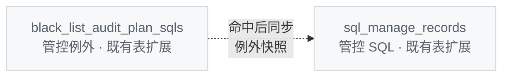
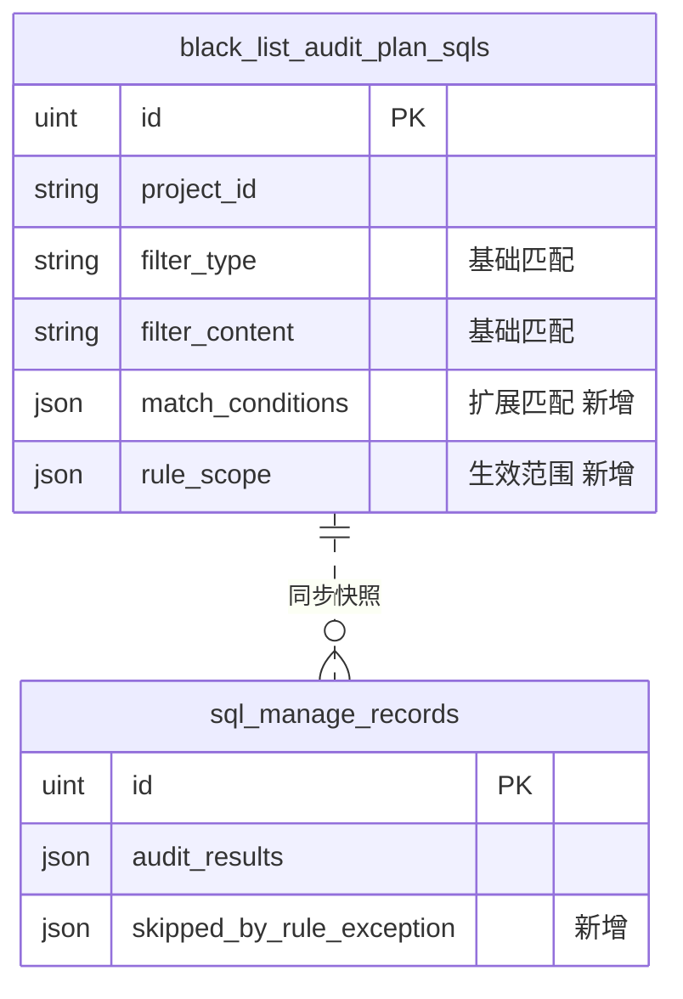

# SQL 管控规则例外

## 需求概述

每条管控例外由 **匹配规则** 与 **生效范围** 两部分组成：

- **匹配规则**：决定哪些 SQL 会命中这条例外
- **生效范围**：决定命中后豁免全部规则，还是仅豁免 1～n 条指定规则

在现有「管控 SQL 例外」基础上，扩展匹配为可组合配置（数据源、扫描任务、指纹、IP 等），并扩展生效范围至单条 / 多条规则。老数据无需迁移，行为保持不变。

此前匹配为单一维度单选；本次支持多维度组合，扫描任务可作为数据源下的二级筛选项。

## 核心概念

### 匹配规则

决定例外作用于哪些管控 SQL。各维度可组合，未配置表示「不限」：


| 维度                                | 说明                                                       |
| --------------------------------- | -------------------------------------------------------- |
| 项目                                | 必选                                                       |
| 数据源                               | 可选；限定实例 / 数据源                                            |
| 扫描任务                              | 可选；两条独立筛选项：`audit_task_type`（任务类型）、`audit_task_id`（任务实例） |
| SQL 指纹                            | 可选；精确或模糊（沿用 fp_sql 逻辑）                                   |
| IP / CIDR / Host / DB 用户 / SQL 文本 | 可选；可与上述维度组合                                              |


### 生效范围（豁免哪些规则）


| 模式   | 配置         | 命中后行为                      |
| ---- | ---------- | -------------------------- |
| 全部规则 | 不指定规则      | 老逻辑：整 SQL 豁免，不进管控审核，标记已为例外 |
| 指定规则 | 选择 1～n 条规则 | SQL 仍参与审核，仅跳过所列规则          |


### 示例

慢日志扫描采集到来自 `10.0.1.50` 的 SQL，审核命中 `dml_check_where_is_invalid`、`dml_check_affected_rows` 等规则：


| 匹配                      | 生效范围                            | 效果                                 |
| ----------------------- | ------------------------------- | ---------------------------------- |
| IP = `10.0.1.50`        | 全部规则                            | 该 IP 下 SQL 整 SQL 豁免，不进审核（老逻辑）      |
| IP = `10.0.1.50`        | 规则 `dml_check_where_is_invalid` | 该 IP 下 SQL 仅跳过「无 WHERE」规则，其它规则照常检查 |
| 数据源 A + 扫描任务「慢日志」+ 指纹 X | 规则 R1、R2                        | 仅在该组合下豁免 R1、R2                     |


### 生效优先级

同一 SQL 同时命中多种处理时，按以下顺序：

1. SQL 管控状态「已忽略」（`status=ignored`）：整条 SQL **不再进入周期性审核队列**，也不刷新例外快照
2. 生效范围 = **全部规则** 的例外：整 SQL 豁免，不进管控审核，标记已为例外
3. 生效范围 = **指定规则** 的例外：仅跳过对应规则，SQL 仍参与审核

> **与「已忽略」的关系**：「已忽略」是 SQL 管控记录上的处理状态（用户手动标记）。优先级最高：一旦为已忽略，周期性审核不再拉取该 SQL，例外规则的快照同步亦跳过。这与「全部规则例外」（采集/入队阶段拦截）和「指定规则例外」（审核时跳过部分规则、仍保存豁免快照）互不冲突。


## 与现有管控 SQL 例外的关系

**老版本**

- 匹配：单一维度单选（sql / fp_sql / ip / cidr / host / instance / db_user 择一）
- 生效范围：仅「全部规则」
- 命中后不进管控审核队列（维持现状）；管控侧标记该 SQL 已添加为例外

**本次扩展**

- 匹配：多维度可组合
- 生效范围：「全部规则」或「指定 1～n 条规则」


## 数据模型（ER 变更）

> 本节仅展示本次涉及的表结构变化。**绿色** 为新增字段 / 新增关联。不新增表。


### 匹配与生效范围的存储


| 概念   | 存储                                                   |
| ---- | ---------------------------------------------------- |
| 基础匹配 | `filter_type` + `filter_content`（保留，既有）              |
| 扩展匹配 | `match_conditions` JSON，可空；**每项一条筛选项**，与基础条件 **AND** |
| 生效范围 | `rule_scope` JSON：`"ALL"` 或 `["rule_name", …]`       |


命中逻辑：`Match(filter_type, filter_content) AND Match(match_conditions…)`；`rule_scope` 决定豁免全部规则或指定规则。

### 关系概览







### 字段变更明细

**1.** `black_list_audit_plan_sqls`**（管控例外 · 既有表扩展）**


| 字段                                                                                | 类型             | 说明                                         |
| --------------------------------------------------------------------------------- | -------------- | ------------------------------------------ |
| id, project_id, filter_type, filter_content, desc, matched_count, last_match_time | —              | 既有；`filter_type` + `filter_content` 仍为基础筛选 |
| match_conditions                                                                  | json, nullable | 扩展匹配；**数组每项为一条筛选项**，全部满足才命中（与基础 AND）       |
| rule_scope                                                                        | json           | 生效范围：`"ALL"` 或规则名数组                        |
| reason                                                                            | varchar        | 添加备注（可选）                                   |
| created_by                                                                        | varchar        | 添加人（可选）                                    |


`match_conditions` 示例（扫描任务占 **2 条**筛选项）：

```json
[
  {"type": "instance", "content": "123"},
  {"type": "db_type", "content": "MySQL"},
  {"type": "audit_task_type", "content": "mysql_slow_log"},
  {"type": "audit_task_id", "content": "100"}
]
```

「特定扫描任务 + 指纹」完整示例（基础 1 条 + 扩展 2 条）：

```text
filter_type:    fp_sql
filter_content: "select * from orders where id = ?"

match_conditions: [
  {"type": "audit_task_type", "content": "mysql_slow_log"},
  {"type": "audit_task_id", "content": "100"}
]
```

`rule_scope` 示例：

```json
"ALL"
```

```json
["dml_check_where_is_invalid"]
```

老数据兼容：`match_conditions` 为空、`rule_scope` 为空（DB 默认 null）→ 业务层归一化为 `"ALL"`，读时 `match_conditions` 为 null、`rule_scope` 为 `"ALL"`；行为与现网一致。

**2.** `sql_manage_records`**（管控 SQL · 既有表扩展）**


| 字段                                        | 类型   | 说明             |
| ----------------------------------------- | ---- | -------------- |
| id, audit_results, first_audit_results, … | —    | 既有             |
| skipped_by_rule_exception                 | json | 当次审核因例外跳过的规则快照 |


添加 / 取消例外后同步更新该字段；**不更新** `updated_at`、`last_audit_time`。

### 两类「命中」时机（勿混淆）


| 时机            | 作用          | 说明                                                                                                           |
| ------------- | ----------- | ------------------------------------------------------------------------------------------------------------ |
| **入队 / 采集时**  | ALL 范围例外    | 新 SQL 写入管控前按 blacklist 过滤，命中则**不进入** `sql_manage_records`                                                    |
| **审核时**       | 指定规则例外      | 周期性审核**不**对已豁免规则跑引擎；豁免规则写入 `skipped_by_rule_exception`，其余规则正常审核并写入 `audit_results` |
| **例外 CRUD 后** | 存量 SQL 快照同步 | 管理员在例外管理页创建/更新/删除例外后，对项目内**已有**管控 SQL 重算 `audit_results` / `skipped_by_rule_exception`，使页面**立即**反映，无需等待下一轮审核 |


> 入队筛选解决「新 SQL 要不要进管控」；CRUD 后同步解决「已有 SQL 页面要不要马上变」。二者互补，非重复。


## 接口设计

> 在现有 v1 管控例外（blacklist）CRUD 上扩展，**不**另起 v2 重写。基础匹配仍用 `type` + `content`；新增可选字段 `match_conditions`、`rule_scope`、`reason`。**不提供**独立的「快捷添加」写接口；SQL 管控页「添加为例外」由前端组装参数后调用 `POST /blacklist`。

**权限**：写接口（创建/更新/删除例外）与读接口（列表/详情）均仅 **系统管理员** 与 **项目管理员** 可调用（与现网 blacklist 一致，按权限值判断）。普通项目成员不可见写入口（由前端隐藏）；SQL 管控读接口对项目成员开放，可看到 `is_exempted` / `skipped_by_rule_exception` 等展示字段。

### 路由一览

**既有路由（扩展请求 / 响应体）**


| 方法     | 路径                                      | 说明   |
| ------ | --------------------------------------- | ---- |
| POST   | `/v1/projects/{project_name}/blacklist` | 创建例外 |
| PATCH  | `/v1/projects/{project_name}/blacklist` | 更新例外 |
| GET    | `/v1/projects/{project_name}/blacklist` | 列表   |
| DELETE | `/v1/projects/{project_name}/blacklist` | 删除例外 |


**新增路由**


| 方法  | 路径                                                     | 说明       |
| --- | ------------------------------------------------------ | -------- |
| GET | `/v1/projects/{project_name}/blacklist/{blacklist_id}` | 例外详情（推荐） |


> **已移除**：`POST/DELETE .../sql_manages/{id}/rule_exceptions` 独立快捷写接口。SQL 管控页「添加为例外」等价于调用 `POST /blacklist`；「取消例外」等价于 `DELETE /blacklist/{blacklist_id}`（`blacklist_id` 来自读接口 `exception_id`）。


### 创建 / 更新请求体

在既有 `type`、`content`、`desc` 基础上扩展：


| 字段               | 类型             | 必填  | 说明                                                |
| ---------------- | -------------- | --- | ------------------------------------------------- |
| type             | string         | 是   | 基础匹配类型，见下表                                        |
| content          | string         | 是   | 基础匹配内容                                            |
| desc             | string         | 否   | 描述（既有）                                            |
| match_conditions | array          | 否   | 扩展匹配；每项 `{type, content}` 一条筛选项，与基础条件 **AND**     |
| rule_scope       | string | array | 否   | 省略或 `"ALL"` = 全部规则（老逻辑）；`["rule_name", …]` = 指定规则 |
| reason           | string         | 否   | 添加备注                                              |


`type` **取值**


| 用途                              | 取值                                                                 |
| ------------------------------- | ------------------------------------------------------------------ |
| 基础匹配（`type` / `content`）        | `sql` | `fp_sql` | `ip` | `cidr` | `host` | `instance` | `db_user` |
| 扩展匹配（`match_conditions[].type`） | 上述全部，另加 `audit_task_type`、`audit_task_id`、`db_type`                |


> 扫描任务类型 **仅** 出现在 `match_conditions` 中，**不可** 作为基础 `type`。基础 `type` 必须为上表 7 种之一。  
> **数据源类型**（`db_type`）同样 **仅** 出现在 `match_conditions` 中：`{"type": "db_type", "content": "MySQL"}`；**无**请求体顶层 `db_type` 字段。  
> 当 `rule_scope` 为指定规则数组时，**必须**在 `match_conditions` 中包含 `db_type`，后端据此校验规则名是否存在于该数据源类型下。

**创建响应**：返回 `blacklist_id`（与既有字段名一致）。

**示例一：老逻辑 — IP + 全部规则**

```json
{
  "type": "ip",
  "content": "10.0.1.50",
  "desc": "内网测试机"
}
```

等价于 `match_conditions` 为空、`rule_scope` 为 `"ALL"`。

**示例二：指纹 + 扫描任务 + 单条规则**

```json
{
  "type": "fp_sql",
  "content": "select * from orders where id = ?",
  "desc": "慢日志已知误报",
  "match_conditions": [
    {"type": "audit_task_type", "content": "mysql_slow_log"},
    {"type": "audit_task_id", "content": "100"},
    {"type": "db_type", "content": "MySQL"}
  ],
  "rule_scope": ["dml_check_where_is_invalid"],
  "reason": "业务主键查询，无需 WHERE 条件"
}
```


### 列表与详情响应

列表项 / 详情在既有字段基础上增加：


| 字段                  | 类型             | 说明                           |
| ------------------- | -------------- | ---------------------------- |
| blacklist_id        | uint           | 例外 ID（既有）                    |
| type, content, desc | —              | 匹配维度（API 首条；UI 合并进「匹配方式」展示） |
| match_conditions    | array | null   | 附加匹配维度（与首条 AND；UI 合并进「匹配方式」） |
| rule_scope          | string | array | 生效范围                         |
| rule_scope_mode     | string         | `all` | `specific`；便于前端展示与筛选 |
| reason              | string         | 添加备注                         |
| created_by          | string         | 添加人                          |
| created_at          | string         | 添加时间                         |


**列表查询参数**


| 参数                                            | 说明                                        |
| --------------------------------------------- | ----------------------------------------- |
| filter_type                                   | 既有；按基础匹配类型筛选                              |
| fuzzy_search_content                          | 既有；模糊匹配 content                           |
| filter_rule_scope_mode                        | 新增；`all` | `specific`                     |
| filter_rule_name                              | 新增；生效范围内含该规则名（**列表页前端不提供此筛选项**）         |
| filter_audit_task_type                        | 新增；`match_conditions` 中 `audit_task_type`（**列表页前端不提供此筛选项**） |
| filter_audit_task_id                          | 新增；`match_conditions` 中 `audit_task_id`（**列表页前端不提供此筛选项**） |
| filter_created_by                             | 新增；添加人                                    |
| filter_created_at_from / filter_created_at_to | 新增；添加时间范围                                 |


### SQL 管控页「添加为例外」（前端调用 blacklist 创建）

前端在 SQL 管控列表/详情点击「添加为例外」时，**直接调用** `POST /v1/projects/{project_name}/blacklist`，请求体示例：

```json
{
  "type": "fp_sql",
  "content": "<该 SQL 指纹>",
  "desc": "慢日志已知误报",
  "match_conditions": [
    {"type": "instance", "content": "<instance_id>"},
    {"type": "audit_task_type", "content": "<source>"},
    {"type": "audit_task_id", "content": "<source_id>"},
    {"type": "db_type", "content": "<audit_plan_db_type>"}
  ],
  "rule_scope": ["dml_check_where_is_invalid"],
  "reason": "主键点查，已知安全"
}
```


| 字段               | 取值                                                        |
| ---------------- | --------------------------------------------------------- |
| type             | `fp_sql`                                                  |
| content          | 该管控 SQL 的指纹                                               |
| match_conditions | 含 `instance`、`audit_task_type`、`audit_task_id`（取自管控记录上下文） |
| rule_scope       | `[当前规则名]`                                                 |


创建成功后，后端触发项目内存量 SQL 快照同步；响应 `blacklist_id` 可供跳转例外详情。

**取消**：读接口返回的 `exception_id` 即 `blacklist_id`，调用 `DELETE /v1/projects/{project_name}/blacklist/{blacklist_id}/`。

### v2 管控 SQL 读接口扩展

**审核结果项（**`audit_results` **内每条规则）**


| 字段           | 类型          | 说明              |
| ------------ | ----------- | --------------- |
| is_exempted  | bool        | 该规则是否已因例外豁免     |
| exception_id | uint | null | 关联例外 ID；可跳转例外详情 |


**独立区块** `skipped_by_rule_exception`

与存储层字段一致，单独返回因例外跳过的规则明细（规则名、原级别、添加人、时间、备注等），供「已例外规则」区块展示；不入 `audit_results` 存储。

### 向后兼容


| 场景     | 行为                                                                                        |
| ------ | ----------------------------------------------------------------------------------------- |
| 老客户端   | 仅传 `type` + `content` → 读时 `match_conditions` 为 null，`rule_scope` 为 `"ALL"`               |
| 老 DB 行 | `match_conditions` / `rule_scope` 为空 → 读接口归一化为 `"ALL"`                                    |
| 字段命名   | 保留 `type`、`content`、`blacklist_id` 等既有 API 字段名，与 `filter_type`、`filter_content` 存储层映射关系不变 |


## 功能说明


### 添加入口

**入口一：SQL 管控例外管理（沿用原入口，调整添加方式）**

- 位置：项目设置「SQL 管控例外管理」
- 分别配置 **匹配方式**（多维度可组合）与 **生效范围**
- 匹配方式：数据源、指纹、扫描任务、IP 等维度可组合；表单为可增删的条件行，不向用户暴露 API 的「基础 / 扩展」拆分
- **数据源匹配（`instance`）**：下拉仅展示当前项目下用户可选实例，接口 `getInstanceTipListV1`，参数 `project_name` + `functional_module=sql_manage`；提交 `content` 为 `instance_id`
- 生效范围：规则选填；不选 = 全部规则（老逻辑）；选 1～n 条 = 仅豁免所选规则
- **指定规则 UX**：选「指定规则」后先选数据源类型（`rule_tips` 分组键），再选该类型下规则；提交时将 `db_type` 写入 `match_conditions`（非顶层字段）；编辑回显自 `match_conditions` 回填类型，不在匹配方式行重复展示

**入口二：SQL 管控列表 / 详情（添加为例外）**

- 位置：SQL 管控列表、SQL 详情、扫描任务内 SQL 列表 / 详情
- 在每条已触发规则旁提供「添加为例外」（icon，hover 提示，点击弹出备注弹窗）
- **匹配**：前端自动填充项目、数据源、SQL 指纹、扫描任务
- **生效范围**：自动填充当前规则（指定 1 条）
- **接口**：前端组装后调用 `POST /blacklist`（见上节），**不**使用独立快捷写路由

**权限**

- **系统管理员、项目管理员** 可见并可操作（写接口按权限值校验）
- 普通项目成员不可见写入口（前端隐藏）


### 添加与取消

**添加**

- 备注选填；弹窗推荐填写原因
- 系统记录匹配各维度、生效范围内规则名称 / 描述 / 原级别、操作人、操作时间
- 同一匹配 + 生效范围重复添加不产生重复记录
- 接口流程：写入例外配置 → 同步更新对应 SQL 管控记录（审核结果快照、审核级别等），使页面即时反映例外状态
- 同步更新管控记录时，**不更新** `updated_at`、`last_audit_time` 等审核时间字段

**取消**

- 支持在例外管理及 SQL 详情中取消
- 取消后同步回写对应 SQL 管控记录（恢复规则展示、重算审核级别与快照等）
- 取消时同样不更新 `updated_at`、`last_audit_time`

**生命周期**

- 永久生效，可手动取消
- 本期不支持过期时间与一次性例外


### 添加后的页面反馈

- 已添加为例外的规则展示「已例外」标签，与正常触发规则区分
- 标签可点击，跳转至「SQL 管控例外管理」中对应例外记录（携带 `exception_id`）
- 接口在规则项返回例外关联信息（如 `exception_id`、是否已例外）


### 命中后的处理

**生效范围 = 全部规则（老逻辑）**

- 维持现状：命中后不进入管控审核队列
- 管控侧标记该 SQL 已添加为例外

**生效范围 = 指定规则（1～n 条）**

- SQL 仍进入管控并参与审核
- 对已豁免规则：**不跑规则引擎**，不写入 `audit_results`，不参与审核级别与整改 diff
- 将豁免规则信息写入 `skipped_by_rule_exception`（含规则原级别，优先取自历史审核结果 / 例外快照 / 规则模板级别）；随管控记录持久化，后续周期性审核时刷新该快照

**与其它能力的关系**

- 本能力仅作用于 SQL 管控，不改变 SQL 审核例外（`audit_whitelist`）行为


### 审核结果展示

**当前审核结果 + 独立「已例外规则」区块**

- **当前审核结果**：展示仍正常触发的规则；展示层将快照中的例外规则合并返回，并标识「已例外」，可跳转例外记录
- **已例外规则**（独立区块）：展示因例外跳过的规则明细，字段见下表
- **审核结果对比**（最初 vs 当前）：已例外规则出现在当前侧，标识为例外；最初侧保持历史快照；diff 不计入 resolved / new / unchanged

例外规则不入 `audit_results`（存储层）；由接口合并至展示层。

已例外规则区块字段：


| 字段    | 说明                                                           |
| ----- | ------------------------------------------------------------ |
| 规则名   | 规则名称及中文描述                                                    |
| 规则原级别 | error / warn / notice；**添加例外前**该规则在审核结果中的级别，用于「已例外规则」区块与操作审计 |


> **「规则原级别」示例**：SQL 审核命中 `dml_check_where_is_invalid`，级别为 `error`。用户添加为例外后，「已例外规则」区块展示「规则原级别：error」；操作审计记录 `rule_name=dml_check_where_is_invalid, level=error`，便于事后追溯该例外豁免的是哪一档风险。
> | 添加人   | 例外添加人                 |
> | 添加时间  | yyyy-MM-dd HH:mm:ss   |
> | 添加备注  | 添加时填写的原因              |
> | 操作    | 取消例外；查看审计；跳转例外记录      |


### 例外管理与审计

**例外管理**

- 沿用「SQL 管控例外管理」入口，分别展示 **匹配方式** 与 **生效范围**
- **列表 — 匹配方式**：仅展示各维度的中文标签（如「SQL 指纹、数据源、扫描任务类型」），**不展示**具体 content 值；多个维度用顿号连接
- **列表 — 生效范围**：仅展示「全部规则」或「指定规则」，**不展示**具体规则名称
- **详情布局**：卡片瀑布流（每字段一张卡片，字段标题加粗，标签在上、值在下），**不使用** Descriptions/Table 表单；**顶部**一张卡片同一行展示添加人 / 添加时间 / 命中次数 / 最近命中时间
- **详情 — 匹配方式**：将 `type`+`content` 与 `match_conditions` 合并为内部列表展示（每项独立背景色块 + 间距）；SQL 指纹默认截断并可展开；审核任务展示 **名称 + 跳转**（非 ID）；**不使用「基础匹配 / 扩展匹配」分列**
- **详情 — 生效范围**：全部规则时展示文案；指定规则时列出规则名称（`rule_tips` 映射），每条规则独立背景项，**不展示**「指定 N 条规则」
- **列表筛选**：搜索框右侧默认折叠，点击「筛选」按钮展开（筛选项与搜索框同一行）；支持匹配维度、生效范围模式、添加人、添加时间；**不提供**规则名、扫描任务 ID 筛选项

**审计**

- 添加、取消写入平台操作审计（通过 `POST/PATCH/DELETE /blacklist`）
- 记录：操作类型、操作人、操作时间、匹配各维度、生效范围（全部规则 / 指定规则列表）、备注；若 `rule_scope` 含具体规则，记录各规则的**原级别**（取自添加时 `audit_results` 中对应项的 `level`）
- 例外管理页提供审计查询


## 验收标准

1. 系统管理员、项目管理员可使用两个入口添加例外；普通成员不可见写入口。
2. 例外管理页支持配置 **匹配方式**（多维度可组合）与生效范围；未配置的维度表示不限。
3. 生效范围 = 全部规则时，行为与老版本一致（整 SQL 不进审核、标记已例外）。
4. 生效范围 = 指定 1～n 条规则时，仅跳过对应规则，其它规则正常命中。
5. SQL 管控页「添加为例外」由前端组装参数调用 `POST /blacklist`，并写入例外配置。
6. 添加 / 取消后立即同步管控记录与页面展示；不更新 `updated_at`、`last_audit_time`。
7. 页面上已例外规则展示「已例外」标签，可跳转至例外管理对应记录。
8. 生效优先级：已忽略 > 全部规则例外 > 指定规则例外。
9. 审核结果页展示「当前审核结果」+ 独立「已例外规则」区块；对比视图中例外规则在当前侧标识为例外。
10. 取消例外后管控记录与页面状态同步恢复。
11. 添加、取消操作可审计查询。

